# Query Builder - Arquitectura de la Aplicación

## 🏗️ Diagrama de Arquitectura General

```mermaid
graph TB
    subgraph "Frontend - React + TypeScript"
        A[App.tsx] --> B[Navigation]
        A --> C[Main Content Area]
        
        B --> D[Builder Tab]
        B --> E[Editor Tab] 
        B --> F[Results Tab]
        B --> G[Management Tab]
        
        C --> H[AdvancedQueryBuilder]
        C --> I[SqlEditor]
        C --> J[QueryResults]
        C --> K[QueryManagement]
    end
    
    subgraph "Backend - Node.js + Express"
        L[Server.js] --> M[API Routes]
        M --> N[/api/schema]
        M --> O[/api/execute]
        M --> P[/api/tables]
    end
    
    subgraph "Database"
        Q[(PostgreSQL)]
        Q --> R[users]
        Q --> S[products]
        Q --> T[orders]
        Q --> U[categories]
    end
    
    A --> L
    L --> Q
    
    style A fill:#e1f5fe
    style L fill:#f3e5f5
    style Q fill:#e8f5e8
```

## 🧩 Estructura de Componentes


## 🔄 Flujo de Datos

```mermaid
sequenceDiagram
    participant U as Usuario
    participant A as App.tsx
    participant QB as QueryBuilder
    participant SG as SqlGenerator
    participant API as Backend API
    participant DB as PostgreSQL
    
    Note over U,DB: 1. Inicialización
    U->>A: Carga aplicación
    A->>API: GET /api/schema
    API->>DB: Query schema tables
    DB-->>API: Schema data
    API-->>A: Schema response
    A->>A: Generate SemanticLayer
    
    Note over U,DB: 2. Construcción de Query
    U->>QB: Selecciona campos
    QB->>A: Update query state
    A->>SG: Generate SQL
    SG-->>A: SQL string
    
    Note over U,DB: 3. Ejecución
    U->>A: Click Execute
    A->>API: POST /api/execute {sql}
    API->>DB: Execute SQL
    DB-->>API: Query results
    API-->>A: Results data
    A->>A: Update results state
    
    Note over U,DB: 4. Guardar Query
    U->>A: Save query
    A->>A: Store in localStorage
```



## 📱 Estados de la Aplicación


## 🎨 Estructura de Estilos Actual


## 🔧 Servicios y Utilidades


## 🎯 Plan de Refactorización

```mermaid
timeline
    title Modernización de UI/UX
    
    section Fase 1: Fundamentos
        Semana 1 : Setup Tailwind CSS
                 : Design System Tokens
                 : Color Palette
                 : Typography Scale
                 
    section Fase 2: Componentes
        Semana 2 : Refactor App Layout
                 : Navigation Component
                 : Query Builder UI
                 : Dark/Light Theme
                 
    section Fase 3: Interacciones
        Semana 3 : Micro-animations
                 : Loading States
                 : Error Handling
                 : Responsive Design
                 
    section Fase 4: Pulimiento
        Semana 4 : Accessibility
                 : Performance
                 : Testing
                 : Documentation
```

## 📊 Métricas de Mejora Objetivo

```mermaid
gitgraph
    commit id: "v1.0 - Estado Actual"
    branch feature/modern-styling
    checkout feature/modern-styling
    commit id: "Setup Design System"
    commit id: "Implement Dark Theme"
    commit id: "Responsive Layout"
    commit id: "Accessibility Improvements"
    commit id: "Performance Optimization"
    checkout main
    merge feature/modern-styling
    commit id: "v2.0 - Modern UI"
```

---

### 📈 KPIs de Mejora

| Métrica | Actual | Objetivo | Mejora |
|---------|--------|----------|--------|
| CSS Lines | 1623 | 800 | -50% |
| Load Time | 2.5s | 1.5s | -40% |
| Mobile Score | 65/100 | 90/100 | +38% |
| Accessibility | 70/100 | 95/100 | +36% |
| Bundle Size | 2.1MB | 1.5MB | -29% |
